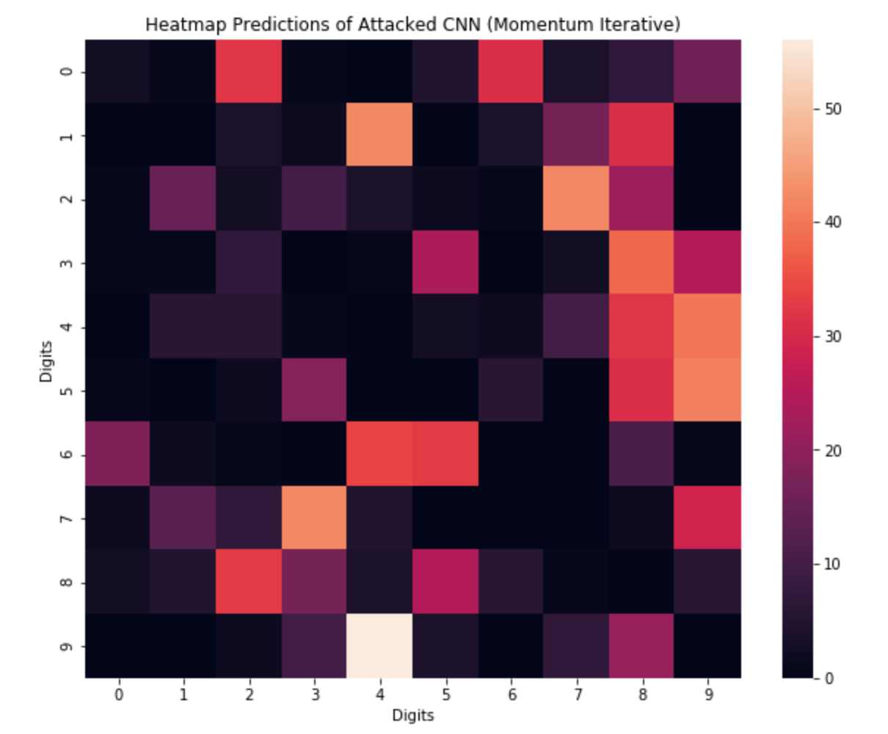
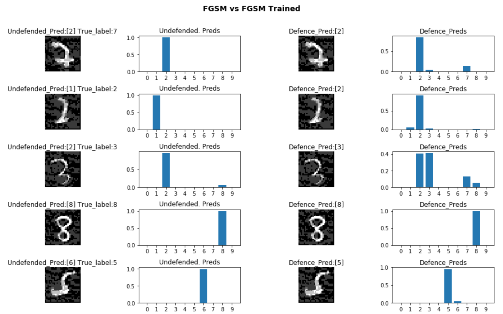

The project explores the vulnerability of deep CNN based model to adversarial attacks. Deep CNN models are used for image classification, here we analyze for the simple task of handwritten digit classification using MNIST dataset.

However, these models are not robust, and have been shown to be vulnerable to minor perturbations to the input, as are done to generate what we call adversarial attacks.
We explore two attack methods: Fast Gradient Sign Method (FGSM) and Momentum Iterative Method (MIM). We show that a model that gives accuracy of 96% on the original MNIST dataset fails miserably when dealing with such attacks. 
E.g. for FGMS the accuracy drops to around 30%, and it is just 0.6% for MIM!

<figure>
   </img> 
    <figcaption><b>Original label (Y-axis) to Predicted label (X-axis)</b></figcaption>
</figure>

Next, we explore a defence mechanism known as adversarial training, where we train the model with batches of such attacked images.
We train the model with samples of FGSM attacked images. 
We show that this drastically improves the robustness of the model for both attacks, for FGSM it goes to 93.4% whereas it improves to 77.6% for MIM.

<figure>
   </img> 
    <figcaption><b>Prediction probabilities for original model and defended model to attacked images</b></figcaption>
</figure>

**This project was completed as part of the Machine Learning in Cybersecurity course of Saarland University.**
