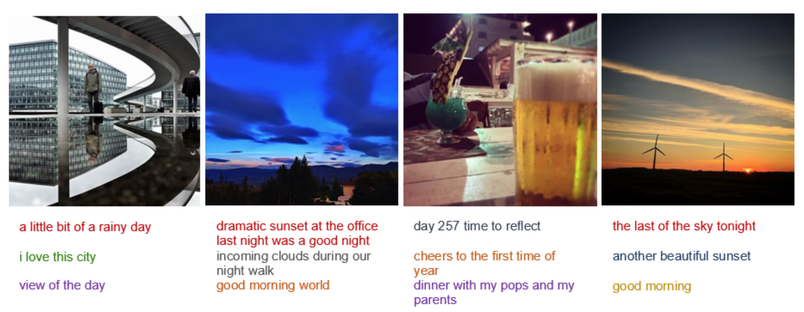

This work explores in detail the paper [Attend to You](https://arxiv.org/abs/1704.06485).
We look at the task of image captioning, that is generating textual description given any image.
However, here, we look at the task with an additional requirement of personalization.
So, a generated caption should reflect the style and vocabulary of particular users.

The model uses context memory cells, CNNs to generate captions using image features as well as particular user's context.
We base our analysis on a small subset of the InstaPIC dataset of the work.

</img>

We explore different architecture choices, e.g. increasing memory capacity, increasing CNN channels and also dropout.
We analyze if changes in these choices affect the outcome.

For dropout, we explore using dropout at different locations of the model.

For metrics, we use BLEU-k, CIDEr, ROUGE_L, METEOR as used in the original work.
We see that increasing model capacity and also applying dropout manages to improve the model performance.
Of course, this needs to be further tested on the entire dataset with longer training durations.
This was not possible due to a lack of computing resources and time.

<figure>
</img>
<figcaption><b>Personalized captions by changing user context per image</b></figcaption>
</figure>

We also output different captions for the same image but changing the user's context to reflect the effect of personalization.
We see how changing the context manages to change the captions quite a bit for each image.
This shows how the model has actually learnt to use the user context and the image features both to generate meaningful but also personalized captions.

**This project was completed as part of the High-level Computer Vision course at Saarland University.**
