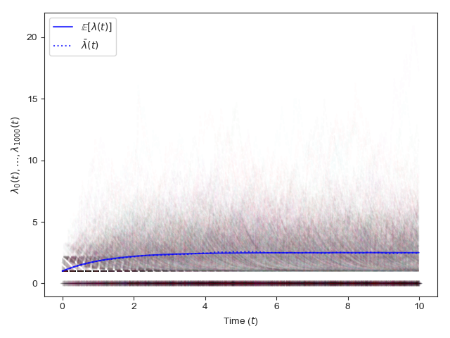
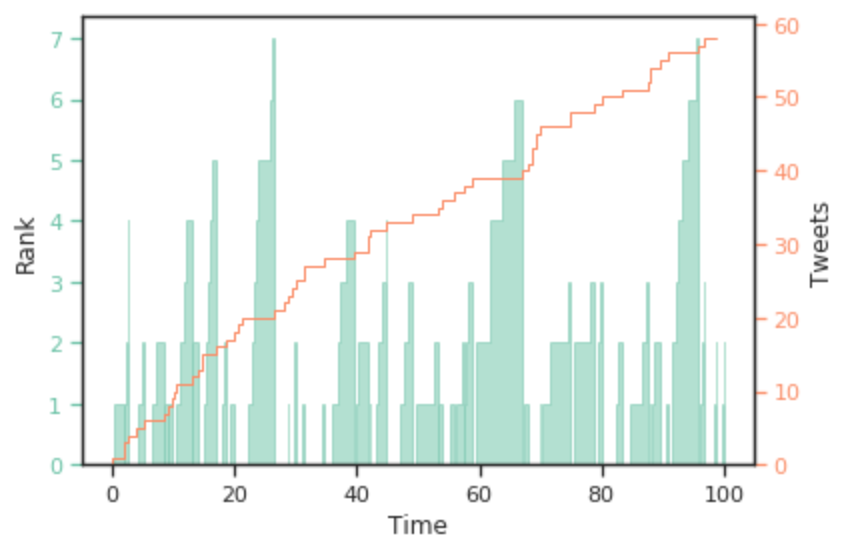
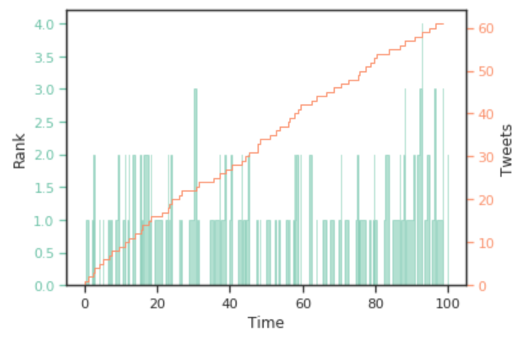

The project comprises studying various algorithms to analyze temporal point processes, including Hawkes algorithm, RedQueen, Smart Poisson. 
I look at the sampling and fitting of some of these algorithms, specifically the Hawkes process in an efficient way using Ogata's thinning method.
<figure>
</img>
<figcaption><b>Fitting Hawkes process</b></figcaption>
</figure>
Finally, I apply these techniques to a use-case to solve the problem of smart broadcasting of messages by users of a social network.
The goal is to find optimal moments for users to post messages in order to have maximum exposure for their followers.
The solution is to use such temporal point processes to fit the whole message posting scenario.
Then, we sample from this process to find optimal times to broadcast.

<figure>
</img> 
<figcaption><b>Poisson sampling cannot maintain top-rank over time</b></figcaption>
</figure>
As we can see, posting messages assuming a simple Poisson sampling distribution cannot get good top-1 exposure, and also needs to transmit slightly more messages to remain at the top.
<figure>
</img>
<figcaption><b>RedQueen sampling can maintain top-rank much longer</b></figcaption>
</figure>
However, a smarter algorithm like RedQueen can increase the top rank exposure much better.

**This project was completed as part of the Human-centred Machine Learning course at Saarland University.**
