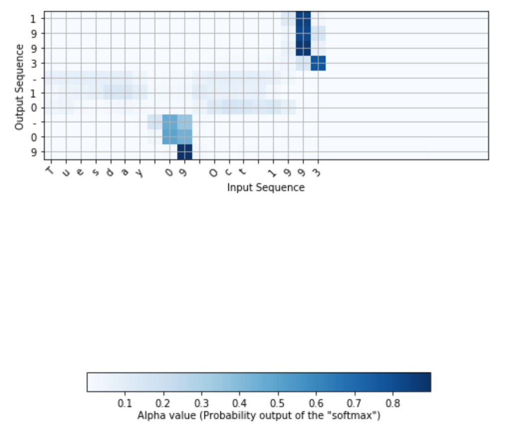

This mini-project explores the task of solving translating between two languages using sequential deep learning models.

For this project, we use a simpler task of translating between date formats.
We use a bi-directional LSTM model.
We also make use of a soft attention mechanism.
This allows the decoder model to learn which parts of the input to concentrate on for translating specific parts of the input.

<figure>
   </img>
    <figcaption><b>Visualizing attention weights</b></figcaption>
</figure>

For example, here we see that for outputting translated year, the model *attends* to the year part.
For the month, it *attends* to the month.

**This project was completed as part of the [Coursera course on Sequential Models](https://www.coursera.org/learn/nlp-sequence-models).**
