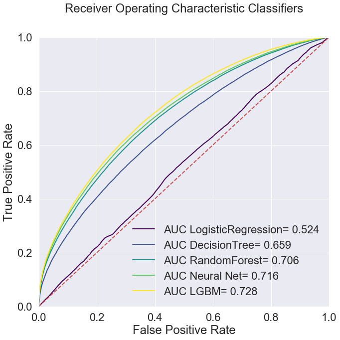
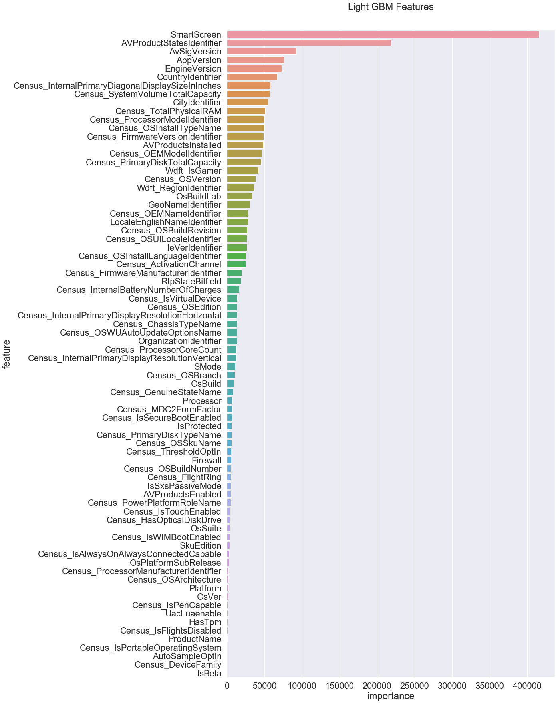

This was a pure data-science project aimed at using techniques in ML/AI to solve a real-world problem. Based on the [Kaggle competition](https://www.kaggle.com/c/microsoft-malware-prediction) hosted by Microsoft, the goal of the project was to predict which Windows machines were prone to future malware attacks.

Microsoft provided a large dataset of anonymized Windows machines with various machine features. I perform basic data analysis of the data for better understanding.
There were a lot of fascinating things I learnt as part of this project.

I learnt how to encode variables more efficiently to allow data analysis and algorithmic learning to be more memory efficient.
I learnt proper preprocessing of the data to allow different algorithms to learn from it.
For e.g. neural networks required categorical data encoding which was made possible by having a separate encoding layer to learn representations.

Finally, I apply multiple methods to solve the task. I use extremely simple models like Logistic Regression and Decision trees, then move on to more complex ensemble method like Random Forest, boosting method in Light GBM and also deep neural networks.

I make a comprehensive comparative study to compare the performances of the models using ROC-AUC (since the dataset is biased with respect to the label).
</img>
I also look at explaining the prediction of the models, especially for the tree-based models. I plot the features by their importance in order to explain which features the models deemed important while making predictions.
</img>
As seen here, some features like AV (antivirus) version, Windows SmartScreen settings were very important. Interestingly, location also seemed to be quite imortant.

**This project was completed as the capstone project for the course Machine Learning in Cybersecurity at Saarland University.**
