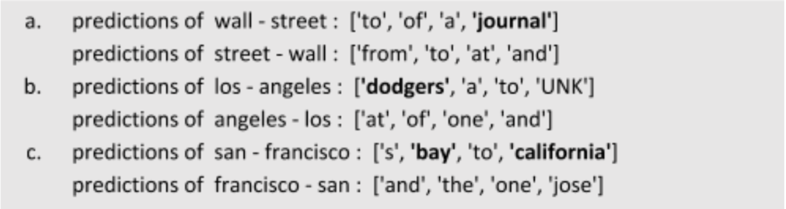

In this work, we explore how we could embed words into a new type of representation.
For NLP, words have been embedded into vectors (Word2Vec, Glove).
However, vector mathematics do not allow smartly recognizing context changes.
E.g. changing the order of words would not have any effect in the corresponding vector computations if we do dot products.

Instead, we attempt to embed the words into matrix form instead.
Matrix multiplication is non-commutative.
We hope that this new technique would make the representations themselves more context-aware.

We perform initial analysis for the same. We modify the Word2Vec model to allow for matrix embedding.
We further test for contextual sense by trying to predict the next token given the previous 2 tokens.

<figure>
</img>
<figcaption><b>Analysis for contextual sense of embedding</b></figcaption>
</figure>

We see that matrix embedding can embed contextual sense.
E.g. for "wall street" we get "street" that signifies a very common trigram "wall street journal".
However, reversing the order and making it "street wall" simply predicts stop-words.
Note that if we use Word2Vec, both "wall street" and "street wall" would give same predictions, which is of course not optimal.

**This work was completed as part of the Machine Learning Seminar at Saarland University, supervised by Prof. [Dietrich Klakow](https://scholar.google.de/citations?user=_HtGYmoAAAAJ&hl=de).**
